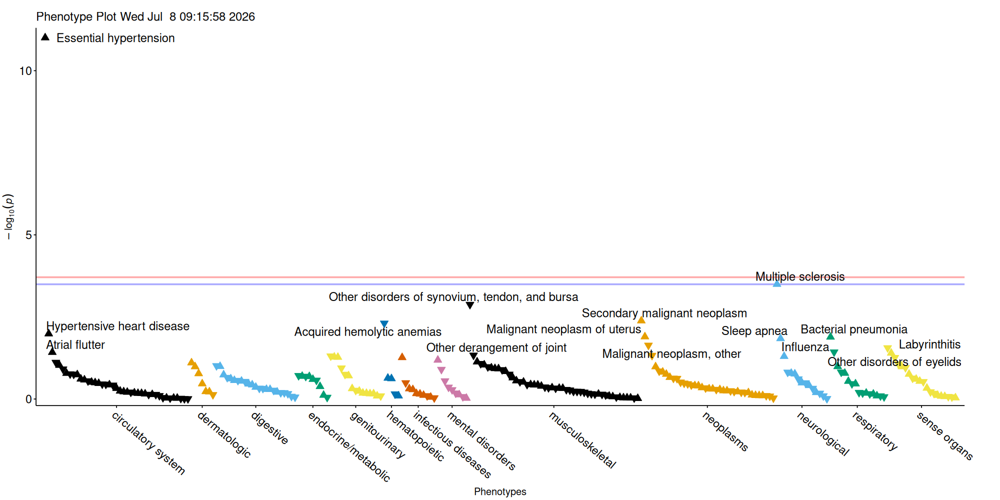
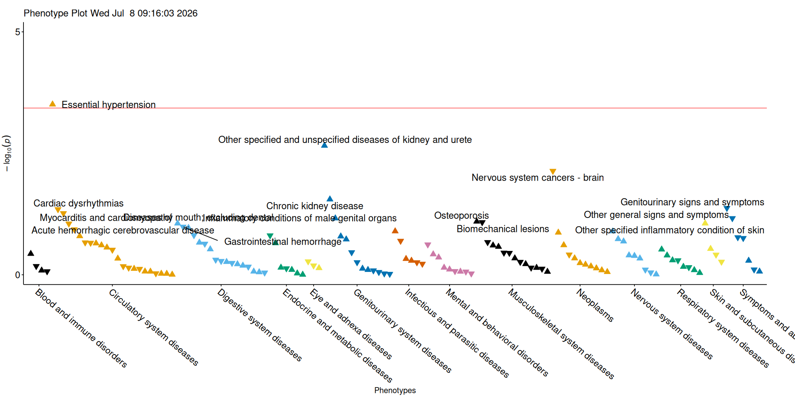

# introduction

``` r

library(ICD10AnalysisToolbox)
#devtools::load_all()
```

The code below generates example input and showcases the workflow.

``` r

icd_table <- data.frame(ID=paste0("ID", sample(1:1000, 20000, replace = T, prob = seq(from = 0, to = 1, length.out=1000))),
                        ICD10=sample(icd10_list, 20000, replace = T),
                        date_event=sample(seq(as.Date('2000/01/01'), as.Date('2020/01/01'), by="day"), 20000, replace = T))

lc_table <- data.frame(ID=paste0("ID", 1:1000),
                       date_baseline=as.Date('2007/01/01'),
                       date_contact_loss=sample(seq(as.Date('2007/01/02'), as.Date('2025/01/01'), by="day"), 1000, replace = T))
```

From this ICD-10 cohort data, we extract Phecode and CCSR terms.

``` r

outcomes_phecode <- time_to_event_phecode(dataframe_ID_BL = lc_table, icd_table_long = icd_table, tbl_mortality_contact = lc_table, censor_time = 10)

outcomes_CCSR <- time_to_event_CCSR(dataframe_ID_BL = lc_table, icd_table_long = icd_table, tbl_mortality_contact = lc_table, censor_time = 10)
```

Next, we simulate a marker associated with hypertension.

``` r

outcomes_phecode$marker[outcomes_phecode$phecode_401_1_event==0] <- rnorm(length(outcomes_phecode$ID[outcomes_phecode$phecode_401_1_event==0]))
outcomes_phecode$marker[outcomes_phecode$phecode_401_1_event==1] <- rnorm(length(outcomes_phecode$ID[outcomes_phecode$phecode_401_1_event==1]))+1

outcomes_CCSR$marker[outcomes_CCSR$CCSR_CIR007_event==0] <- rnorm(length(outcomes_CCSR$ID[outcomes_CCSR$CCSR_CIR007_event==0]))
outcomes_CCSR$marker[outcomes_CCSR$CCSR_CIR007_event==1] <- rnorm(length(outcomes_CCSR$ID[outcomes_CCSR$CCSR_CIR007_event==1]))+1
```

Now we can run our analysis across outcomes.

``` r

phecode_results <- phewas_analysis_phecodes(outcomes_phecode[c("ID", "marker")], outcomes_phecode, save_as = "test", adj_vars = NULL,
                target = "marker", return_tables = TRUE)
#> Scale for shape is already present.
#> Adding another scale for shape, which will replace the existing scale.
#> Running regression 171 times..
#> Reformatting output..
#> Variables significantly related after multiple testing correction: 0
#> Scale for shape is already present.
#> Adding another scale for shape, which will replace the existing scale.

CCSR_results <- phewas_analysis_CCSR(outcomes_CCSR[c("ID", "marker")], outcomes_CCSR, save_as = "test_CCSR", adj_vars = NULL,
                        target = "marker", return_tables = TRUE)
#> Scale for shape is already present.
#> Adding another scale for shape, which will replace the existing scale.
#> Running regression 112 times..
#> Reformatting output..
#> Variables significantly related after multiple testing correction: 0
#> Scale for shape is already present.
#> Adding another scale for shape, which will replace the existing scale.

head(phecode_results[[1]][order(phecode_results[[1]]$p, decreasing = F),], 20)
#>       Phecode_char        HR     negOR       LCI       UCI            p nevent
#> 101  phecode_401_1 3.3851848 0.2954048 2.3829713 4.8089023 9.900820e-12     32
#> 70     phecode_335 2.6148552 0.3824304 1.5491143 4.4137917 3.199912e-04     13
#> 222    phecode_727 0.5827428 1.7160229 0.4191245 0.8102346 1.321005e-03     36
#> 27     phecode_198 1.5957337 0.6266710 1.1593983 2.1962824 4.137926e-03     38
#> 51     phecode_283 0.4554001 2.1958714 0.2632231 0.7878838 4.917857e-03     13
#> 103 phecode_401_21 2.3526491 0.4250528 1.2239531 4.5221974 1.028502e-02     10
#> 20     phecode_182 2.0971497 0.4768377 1.1716091 3.7538432 1.266190e-02     11
#> 151  phecode_480_1 1.7984133 0.5560457 1.1322282 2.8565712 1.291902e-02     18
#> 67   phecode_327_3 2.1459998 0.4659833 1.1643031 3.9554264 1.438282e-02     10
#> 26   phecode_195_1 0.6700859 1.4923460 0.4743834 0.9465236 2.309626e-02     35
#> 98   phecode_386_3 0.6176021 1.6191655 0.4021802 0.9484116 2.766650e-02     22
#> 152    phecode_481 0.5886178 1.6988952 0.3576144 0.9688396 3.711725e-02     16
#> 121 phecode_427_22 1.7447008 0.5731642 1.0318537 2.9500120 3.780367e-02     14
#> 92     phecode_374 1.7433724 0.5736009 1.0261917 2.9617737 3.982289e-02     14
#> 247  phecode_742_9 0.7267582 1.3759735 0.5309121 0.9948492 4.634933e-02     41
#> 10     phecode_155 0.5422273 1.8442451 0.2963288 0.9921764 4.709529e-02     11
#> 188    phecode_590 0.6435545 1.5538700 0.4148049 0.9984508 4.919675e-02     21
#> 72   phecode_338_1 1.8057049 0.5538003 0.9995718 3.2619672 5.016617e-02     11
#> 191    phecode_596 1.8444015 0.5421813 0.9933346 3.4246437 5.252777e-02     10
#> 186  phecode_585_1 1.5626433 0.6399413 0.9936912 2.4573573 5.328994e-02     19
#>     Phecode                                  PhecodeString    PhecodeCategory
#> 101  401.10                         Essential hypertension circulatory system
#> 70   335.00                             Multiple sclerosis       neurological
#> 222  727.00 Other disorders of synovium, tendon, and bursa    musculoskeletal
#> 27   198.00                   Secondary malignant neoplasm          neoplasms
#> 51   283.00                     Acquired hemolytic anemias      hematopoietic
#> 103  401.21                     Hypertensive heart disease circulatory system
#> 20   182.00                   Malignant neoplasm of uterus          neoplasms
#> 151  480.10                            Bacterial pneumonia        respiratory
#> 67   327.30                                    Sleep apnea       neurological
#> 26   195.10                      Malignant neoplasm, other          neoplasms
#> 98   386.30                                  Labyrinthitis       sense organs
#> 152  481.00                                      Influenza        respiratory
#> 121  427.22                                 Atrial flutter circulatory system
#> 92   374.00                     Other disorders of eyelids       sense organs
#> 247  742.90                     Other derangement of joint    musculoskeletal
#> 10   155.00     Cancer of liver and intrahepatic bile duct          neoplasms
#> 188  590.00                                 Pyelonephritis      genitourinary
#> 72   338.10                                     Acute pain       neurological
#> 191  596.00                     Other disorders of bladder      genitourinary
#> 186  585.10                            Acute renal failure      genitourinary
#>            p_adj
#> 101 2.534610e-09
#> 70  4.095888e-02
#> 222 1.127258e-01
#> 27  2.517943e-01
#> 51  2.517943e-01
#> 103 4.091113e-01
#> 20  4.091113e-01
#> 151 4.091113e-01
#> 67  4.091113e-01
#> 26  5.912641e-01
#> 98  6.368163e-01
#> 152 6.368163e-01
#> 121 6.368163e-01
#> 92  6.368163e-01
#> 247 6.368163e-01
#> 10  6.368163e-01
#> 188 6.368163e-01
#> 72  6.368163e-01
#> 191 6.368163e-01
#> 186 6.368163e-01
head(CCSR_results[[1]][order(CCSR_results[[1]]$p, decreasing = F),], 20)
#>     DXCCSR_code        HR     negOR       LCI       UCI            p nevent
#> 9        CIR007 1.8721274 0.5341517 1.3314302 2.6324031 0.0003108048     32
#> 60       GEN006 1.7837019 0.5606318 1.2315997 2.5833008 0.0021962773     27
#> 102      NEO048 0.4568002 2.1891410 0.2577392 0.8096030 0.0072898522     12
#> 57       GEN003 1.5439877 0.6476736 1.0480475 2.2746089 0.0279943261     25
#> 131      SYM011 0.6078977 1.6450136 0.3759857 0.9828556 0.0423048085     17
#> 16       CIR017 0.7539618 1.3263271 0.5721569 0.9935359 0.0448532209     51
#> 7        CIR005 0.6959009 1.4369863 0.4811625 1.0064749 0.0541439626     29
#> 134      SYM016 0.7396211 1.3520437 0.5346164 1.0232371 0.0685678470     37
#> 63       GEN013 1.6171481 0.6183725 0.9638300 2.7133084 0.0686924454     14
#> 90       MUS013 1.5018815 0.6658315 0.9525521 2.3680049 0.0799940874     18
#> 89       MUS012 0.7400827 1.3512003 0.5266409 1.0400303 0.0829418353     34
#> 126      SKN002 1.2457995 0.8026974 0.9681815 1.6030223 0.0875284843     61
#> 30       DIG003 1.4259189 0.7013021 0.9491065 2.1422726 0.0875521158     23
#> 19       CIR021 0.7041213 1.4202099 0.4702570 1.0542889 0.0885159417     24
#> 42       DIG021 0.6784544 1.4739384 0.4258120 1.0809943 0.1026218792     18
#> 43       DIG024 1.6543571 0.6044644 0.8952338 3.0571874 0.1081118175     10
#> 10       CIR008 0.6379945 1.5674117 0.3640398 1.1181113 0.1164219143     12
#> 72       INF008 1.3573725 0.7367174 0.9168355 2.0095865 0.1269466135     25
#> 114      NVS016 1.4151718 0.7066280 0.9056975 2.2112364 0.1272644103     19
#> 107      NEO073 1.1584436 0.8632271 0.9553297 1.4047419 0.1348251045    103
#>                              category
#> 9         Circulatory system diseases
#> 60      Genitourinary system diseases
#> 102                         Neoplasms
#> 57      Genitourinary system diseases
#> 131    Symptoms and abnormal findings
#> 16        Circulatory system diseases
#> 7         Circulatory system diseases
#> 134    Symptoms and abnormal findings
#> 63      Genitourinary system diseases
#> 90    Musculoskeletal system diseases
#> 89    Musculoskeletal system diseases
#> 126    Skin and subcutaneous diseases
#> 30          Digestive system diseases
#> 19        Circulatory system diseases
#> 42          Digestive system diseases
#> 43          Digestive system diseases
#> 10        Circulatory system diseases
#> 72  Infectious and parasitic diseases
#> 114           Nervous system diseases
#> 107                         Neoplasms
#>                               Default.CCSR.CATEGORY.DESCRIPTION.IP      p_adj
#> 9                                           Essential hypertension 0.04195865
#> 60  Other specified and unspecified diseases of kidney and ureters 0.14824872
#> 102                                 Nervous system cancers - brain 0.32804335
#> 57                                          Chronic kidney disease 0.81631344
#> 131                               Genitourinary signs and symptoms 0.81631344
#> 16                                            Cardiac dysrhythmias 0.81631344
#> 7                                   Myocarditis and cardiomyopathy 0.81631344
#> 134                               Other general signs and symptoms 0.81631344
#> 63                  Inflammatory conditions of male genital organs 0.81631344
#> 90                                                    Osteoporosis 0.81631344
#> 89                                           Biomechanical lesions 0.81631344
#> 126                 Other specified inflammatory condition of skin 0.81631344
#> 30                             Diseases of mouth; excluding dental 0.81631344
#> 19                       Acute hemorrhagic cerebrovascular disease 0.81631344
#> 42                                     Gastrointestinal hemorrhage 0.81631344
#> 43   Postprocedural or postoperative digestive system complication 0.81631344
#> 10      Hypertension with complications and secondary hypertension 0.81631344
#> 72                                                 Viral infection 0.81631344
#> 114                                           Sleep wake disorders 0.81631344
#> 107                                               Benign neoplasms 0.81631344
```

Plots for outcome associations:



Phecode outcomes



CCSR outcomes
