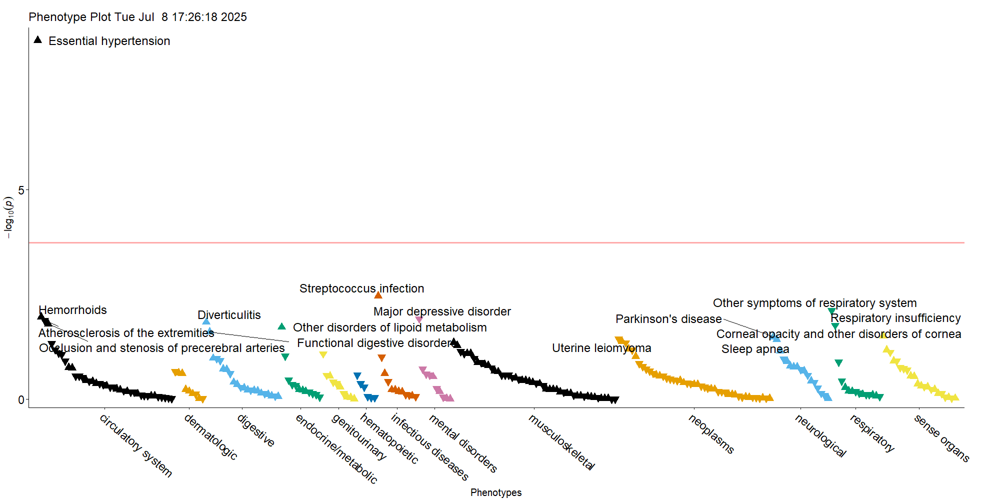
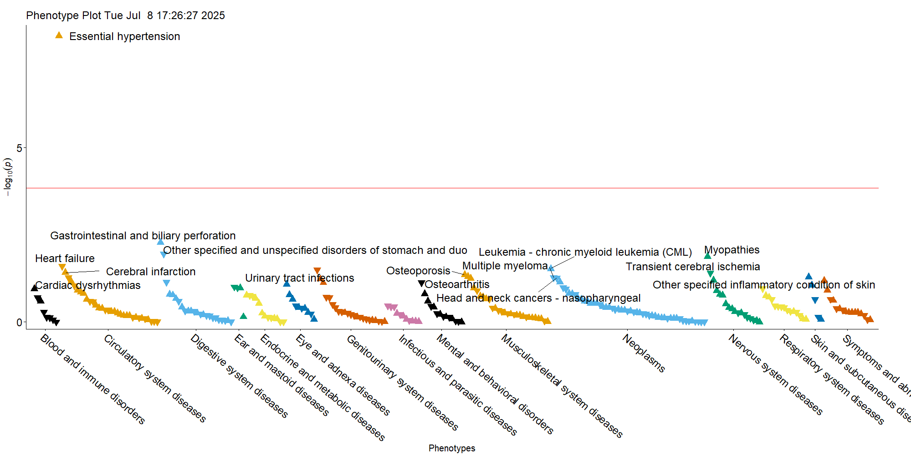

```{r, include = FALSE}
knitr::opts_chunk$set(
  collapse = TRUE,
  comment = "#>"
)
```

```{r setup}
#library(ICD10AnalysisToolbox)
devtools::load_all()
```

The code below generates example input and showcases the workflow.

```{r}
icd_table <- data.frame(ID=paste0("ID", sample(1:1000, 20000, replace = T, prob = seq(from = 0, to = 1, length.out=1000))),
                        ICD10=sample(icd10_list, 20000, replace = T),
                        date_event=sample(seq(as.Date('2000/01/01'), as.Date('2020/01/01'), by="day"), 20000, replace = T))

lc_table <- data.frame(ID=paste0("ID", 1:1000),
                       date_baseline=as.Date('2007/01/01'),
                       date_contact_loss=sample(seq(as.Date('2007/01/02'), as.Date('2025/01/01'), by="day"), 1000, replace = T))
```

From this ICD-10 cohort data, we extract Phecode and CCSR terms.

```{r, results='hide'}
outcomes_phecode <- time_to_event_phecode(dataframe_ID_BL = lc_table, icd_table_long = icd_table, tbl_mortality_contact = lc_table, censor_time = 10)

outcomes_CCSR <- time_to_event_CCSR(dataframe_ID_BL = lc_table, icd_table_long = icd_table, tbl_mortality_contact = lc_table, censor_time = 10)

```

Next, we simulate a marker associated with hypertension.

```{r}
outcomes_phecode$marker[outcomes_phecode$phecode_401_1_event==0] <- rnorm(length(outcomes_phecode$ID[outcomes_phecode$phecode_401_1_event==0]))
outcomes_phecode$marker[outcomes_phecode$phecode_401_1_event==1] <- rnorm(length(outcomes_phecode$ID[outcomes_phecode$phecode_401_1_event==1]))+1

outcomes_CCSR$marker[outcomes_CCSR$CCSR_CIR007_event==0] <- rnorm(length(outcomes_CCSR$ID[outcomes_CCSR$CCSR_CIR007_event==0]))
outcomes_CCSR$marker[outcomes_CCSR$CCSR_CIR007_event==1] <- rnorm(length(outcomes_CCSR$ID[outcomes_CCSR$CCSR_CIR007_event==1]))+1

```

Now we can run our analysis across outcomes.

```{r warning=FALSE}
phecode_results <- phewas_analysis_phecodes(outcomes_phecode[c("ID", "marker")], outcomes_phecode, save_as = "test", adj_vars = NULL,
                target = "marker", return_tables = TRUE)

CCSR_results <- phewas_analysis_CCSR(outcomes_CCSR[c("ID", "marker")], outcomes_CCSR, save_as = "test_CCSR", adj_vars = NULL,
                        target = "marker", return_tables = TRUE)

head(phecode_results[[1]][order(phecode_results[[1]]$p, decreasing = F),], 20)
head(CCSR_results[[1]][order(CCSR_results[[1]]$p, decreasing = F),], 20)

```

Plots for outcome associations:

```{r echo=FALSE, fig.cap="Phecode outcomes", out.width = '100%'}

```

```{r echo=FALSE, fig.cap="CCSR outcomes", out.width = '100%'}

```
